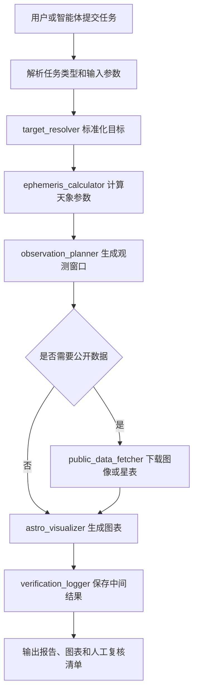

# 星语·面向 AI 的天文实训

## 项目定位

本项目面向“方向 3：星语·面向 AI 的天文实训”，拟建设一个可被智能体稳定调用的天文 skills 包。作品不做泛用天文聊天助手，而是选择天文课堂、科普活动和科研展示中最常见、但目前仍高度依赖人工经验和零散工具的环节：**从观测目标到可复现实训记录的天文观测与科普实训闭环**。

该技能包将观测计划生成、天象计算、公开数据查询、基础图像处理、可视化制图、过程记录和人工校验入口整理为 AI Ready 组件，使智能体能够在明确边界内调用天文工具、保存中间结果、输出可检查报告，并允许教师、科普讲解员或学生复核关键结论。

## 当前实现状态

项目第 1～7 天计划任务已经完成，当前仓库包含三个可以复现的真实案例：

- 建立可安装的 Python `src/` 项目结构和 Pytest 测试环境。
- 使用 Pydantic 定义 `observation_plan` 输入模型。
- 校验目标、经纬度、IANA 时区、起止时间和采样间隔。
- 提供北京 M42 观测任务的标准 JSON 示例。
- 提供 `starskill validate` 命令和结构化校验错误。
- 使用 Astroquery 0.4.11 接入 SIMBAD，输出标准名称、ICRS 坐标、类型、别名和来源。
- 支持 M 编号、英文名和受控中文教学名称规范化，拒绝危险查询字符。
- 提供 SHA-256 键控缓存、损坏缓存恢复和 30 秒服务超时。
- 提供 `starskill resolve` 命令及 `target_resolved.json` 文件输出。
- 使用 Astropy 7.2 计算目标、太阳和月亮的几何 AltAz 坐标。
- 正确处理 `Asia/Shanghai` 跨午夜时间段，并同时保留本地时间与 UTC。
- 按 10 分钟间隔输出固定 7 列的 `ephemeris.csv` 和带来源信息的 `ephemeris.json`。
- 使用离线 IERS 数据和无大气折射设置，避免测试依赖实时网络。
- 使用 Skyfield 1.53 与 DE421 独立抽查 3 个时刻、15 个角量。
- 使用可配置的目标高度和太阳高度阈值生成连续候选观测窗口。
- 输出月面照明比例、月亮高度和目标月亮角距，不用单一月光阈值武断判定。
- 提供 `starskill plan` 命令、固定 10 列的 `visibility.csv` 和完整规划 JSON。
- 使用 Matplotlib 3.10.9 的 Agg 后端生成固定 1800×900 高度角曲线。
- 使用 `starskill run` 串联校验、SIMBAD 解析、星历、观测窗口、制图、报告与复核清单。
- 在 `run.json` 中记录运行状态、依赖版本、来源、缓存命中、问题和产物 SHA-256。
- 使用 Astropy 内置太阳系星历完成上海月亮—木星位置关系案例，并用 Skyfield/DE421 独立抽查。
- 从 SDSS DR18 获取 M51 的 512×512 JPEG，实施超时、5 MB 大小上限、缓存、JPEG 校验和可追溯图像处理。
- 提供可供智能体调用的 `skills/run-starskill` 技能包及 CLI 契约。
- 完成 Markdown 技术报告；根据当前交付要求不制作展示 PPT。

## 选题价值

天文实训常见流程通常包括选择目标、判断可观测时间、查询天体位置、下载公开数据、生成星图或图像、解释观测意义并整理成课堂或科普材料。现有工具虽然成熟，但存在以下痛点：

- 工具分散：天象计算、星表查询、图像下载、可视化制图往往位于不同软件或网站中。
- 人工步骤多：同一任务需要反复复制目标名、坐标、时间、地点和筛选条件。
- 输出难复现：课堂演示或科普活动中经常只保留最终图片，缺少输入参数、查询来源和中间表格。
- 智能体难调用：许多工具面向人工交互设计，缺少统一的输入输出格式、失败提示和复核接口。
- 教学迁移成本高：教师或学生换一个目标、地点或时间后，需要重新理解整套流程。

本项目的核心价值是把上述流程重构为可运行、可检查、可复现、可复用的技能包，让 AI 能承担重复性工具调用和流程整理工作，同时保留科学事实校验和人工判断入口。

## 服务对象

- 中学和高校天文课程教师：快速生成观测实训任务、课堂演示材料和学生操作记录。
- 天文社团与科普场馆讲解员：为公众活动生成当晚可观测目标、天象解释和可视化素材。
- 科研展示和入门训练使用者：将公开天文数据查询、图像处理和图表生成整理成可复现流程。
- AI 智能体开发者：将天文工具作为稳定组件接入教学、科普或科研展示型应用。

## 任务边界

本技能包只处理明确的天文实训任务，不负责开放式闲聊、主观占星内容或未经来源支撑的科学结论。

技能包适合处理：

- 给定地点、时间和目标，生成观测计划。
- 查询天体位置、可见性、高度角、方位角和关键天象时间。
- 根据目标名称或坐标获取公开星表或图像数据。
- 生成星图、可见性曲线、目标信息表和课堂展示图。
- 保存输入参数、中间计算结果、数据来源、最终输出和人工校验记录。

技能包不处理：

- 望远镜硬件自动控制和远程台站排程。
- 未授权的商业星表或受限观测数据。
- 占星、命理或非科学解释。
- 对安全观测风险作出无人工确认的最终判断，例如太阳观测必须保留人工安全复核。

## Skills 清单

| Skill 名称 | 解决的问题 | 触发条件 | 主要输出 |
| --- | --- | --- | --- |
| `target_resolver` | 将中文名、英文名、星表编号或坐标统一解析为标准目标信息 | 用户给出目标名、坐标或天象主题 | 标准名称、赤经赤纬、目标类型、数据来源 |
| `observation_planner` | 判断某目标在指定地点和时间是否适合观测 | 用户给出地点、日期、目标和观测时段 | 可观测窗口、高度角曲线、月相影响、建议观测时间 |
| `ephemeris_calculator` | 计算天体位置、升落时间、方位角、高度角等天象信息 | 用户询问行星、月亮、太阳或亮星位置 | 天象表格、关键时间点、可复核参数 |
| `public_data_fetcher` | 从公开天文数据源获取目标图像或基础星表数据 | 用户需要目标图像、星表或公开观测数据 | 数据文件、来源链接、查询参数、下载日志 |
| `astro_visualizer` | 将计算和数据结果转成教学或科普可视化素材 | 用户要求星图、曲线图、目标卡片或演示图 | PNG/PDF 图表、说明文字、图注和生成参数 |
| `verification_logger` | 保存中间结果和人工校验入口 | 每次完整任务运行后自动触发 | `run.json`、中间 CSV、最终报告、复核清单 |

## 输入与输出

统一输入采用结构化 JSON，便于 API、MCP 或智能体工具调用。

```json
{
  "task_type": "observation_plan",
  "target": "M42",
  "observer": {
    "location_name": "北京",
    "longitude": 116.4074,
    "latitude": 39.9042,
    "timezone": "Asia/Shanghai"
  },
  "time_range": {
    "start": "2026-01-10 18:00:00",
    "end": "2026-01-11 02:00:00"
  },
  "output": {
    "language": "zh-CN",
    "level": "classroom",
    "formats": ["json", "csv", "png", "md"]
  }
}
```

标准输出包括：

- `result.json`：最终结构化结论。
- `intermediate/target_resolved.json`：目标解析结果。
- `intermediate/ephemeris.csv`：天象计算表。
- `intermediate/visibility.csv`：可观测性数据。
- `figures/visibility_curve.png`：高度角或可见性曲线。
- `figures/finder_chart.png`：目标定位或展示图。
- `report.md`：面向课堂、科普或科研展示的说明报告。
- `review_checklist.md`：人工校验清单。

## 技能包流程



该流程强调一个明确闭环：**输入任务 - 调用工具 - 保留中间结果 - 输出材料 - 人工复核**。评审或使用者可以根据保存的 JSON、CSV、图片和日志复现实训过程，而不是只看到最终文字答案。

## 安装与调用示例

当前可运行版本需要 Python 3.11 或更高版本。克隆仓库后执行：

```powershell
python -m venv .venv
.venv\Scripts\Activate.ps1
python -m pip install -e ".[dev]"
python -m pytest
```

macOS 或 Linux 的激活命令为 `source .venv/bin/activate`。

校验文档中的 M42 示例：

```bash
python -m starskill validate examples/observation_m42_beijing.json
```

校验成功时命令返回退出码 `0` 和补齐默认值后的 JSON。输入不符合 Schema 时返回退出码 `2`，并向标准错误输出结构化错误详情。

通过 SIMBAD 解析目标并保存中间结果：

```bash
python -m starskill resolve M42 \
  --cache-dir cache/targets \
  --output runs/m42/intermediate/target_resolved.json
```

目标解析成功返回退出码 `0`；非法目标名返回 `2`；目标未找到返回 `3`；SIMBAD 服务失败返回 `4`。错误详情均以 JSON 写入标准错误。第 2 天的真实运行记录位于 `runs/day2_m42/intermediate/target_resolved.json`，检索说明位于 `docs/day2-target-resolver.md`。

使用任务输入和目标解析结果计算星历：

```bash
python -m starskill ephemeris examples/observation_m42_beijing.json \
  --target-file runs/day2_m42/intermediate/target_resolved.json \
  --output runs/day3_m42/intermediate/ephemeris.csv \
  --metadata runs/day3_m42/intermediate/ephemeris.json
```

该命令为北京 2026-01-10 18:00 至次日 02:00 生成 49 个采样点。第 3 天的计算说明位于 `docs/day3-ephemeris-calculator.md`。如需复现独立核验，先执行 `python -m pip install -e ".[validation]"`，再运行：

```bash
python scripts/verify_day3_skyfield.py \
  examples/observation_m42_beijing.json \
  runs/day2_m42/intermediate/target_resolved.json \
  runs/day3_m42/verification/skyfield_crosscheck.csv
```

使用星历结果生成候选观测窗口和高度角曲线：

```bash
python -m starskill plan runs/day3_m42/intermediate/ephemeris.json \
  --output runs/day4_m42/intermediate/visibility.csv \
  --metadata runs/day4_m42/result.json \
  --figure runs/day4_m42/figures/visibility_curve.png \
  --min-target-altitude-deg 30 \
  --max-sun-altitude-deg -12
```

默认规则包含阈值本身，即目标高度角等于 30 度、太阳高度角等于 -12 度时视为合格。M42 北京案例得到 19:40 至次日 01:20 的一个候选窗口；规则、月光证据、失败原因和图表说明见 `docs/day4-observation-planner.md`。

一条命令运行 M42 观测闭环：

```bash
python -m starskill run examples/observation_m42_beijing.json \
  --output-dir runs/day5_m42 \
  --cache-dir cache/targets
```

计算上海月亮与木星的位置关系：

```bash
python -m starskill relationship examples/moon_jupiter_shanghai.json \
  --output runs/day6_moon_jupiter/relationship.csv \
  --metadata runs/day6_moon_jupiter/relationship.json
```

获取并处理 SDSS DR18 的 M51 图像：

```bash
python -m starskill fetch-image examples/m51_sdss_image.json \
  --output-dir runs/day6_m51 \
  --cache-dir cache/sdss
```

完整流水线的产物契约见 `docs/day5-pipeline.md`，两个扩展案例见 `docs/day6-public-data-and-cases.md`，技能包说明见 `docs/day7-skill-package.md`，最终总结见 `docs/final-technical-report.md`。
```

## 依赖来源与改造说明

本项目优先基于成熟开源天文生态进行 AI Ready 改造，不重复造基础天文计算工具。计划接入或兼容的依赖包括：

| 依赖或数据源 | 用途 | 来源与许可说明 | 改造内容 |
| --- | --- | --- | --- |
| Astropy | 坐标、时间、单位和天文基础计算 | 开源 Python 天文核心库，遵循其官方许可证 | 封装为稳定的输入输出接口，隐藏复杂参数 |
| Astroquery | 查询 SIMBAD、VizieR、MAST 等公开数据 | 开源查询工具，具体数据遵循对应数据库政策 | 增加查询缓存、来源记录和失败重试 |
| Skyfield | 独立核验目标、太阳和月亮位置 | 开源 Python 天文计算库 | 与 Astropy 结果交叉检查，不参与生产结果生成 |
| Matplotlib | 曲线图、星图和教学图表 | 开源绘图库 | 固定图表模板和图注格式 |
| 公开天文数据库 | 星表、图像和目标元数据 | 以各数据库公开说明和引用要求为准 | 保存查询参数、访问时间和来源链接 |

如果后续接入老旧脚本或 Notebook，本项目会将其改造成标准函数、命令行入口或 MCP 工具，并补充参数校验、日志记录、异常处理和示例输入。

## 失败处理方式

| 失败类型 | 处理方式 | 输出给用户的信息 |
| --- | --- | --- |
| 目标名无法解析 | 返回候选目标或要求补充坐标 | 说明无法唯一匹配，并列出可选名称 |
| 时间或地点缺失 | 使用结构化错误阻止继续运行 | 标明缺失字段和示例格式 |
| 目标不可见 | 仍输出计算结果和不可见原因 | 给出最大高度角、太阳高度、月光影响等依据 |
| 数据源不可访问 | 启用缓存或降级到仅计算模式 | 标明未下载数据，不伪造图像结果 |
| 图表生成失败 | 保留 CSV 和 JSON 中间结果 | 说明图表失败但数据可复核 |
| 科学安全风险 | 强制加入人工复核项 | 例如太阳观测需确认滤光设备和安全流程 |

## 三类典型任务运行记录

### 记录一：校园观测计划生成

任务目标：为北京某中学天文社生成一次 M42 猎户座大星云观测实训计划。

输入：

```json
{
  "task_type": "observation_plan",
  "target": "M42",
  "location_name": "北京",
  "date": "2026-01-10",
  "time_range": "18:00-02:00"
}
```

关键中间结果：

- `target_resolved.json`：确认 M42 为 Orion Nebula，目标类型为弥漫星云。
- `visibility.csv`：记录每 10 分钟高度角、方位角和太阳高度。
- `moon_condition.json`：记录月相、月亮高度和角距。
- `visibility_curve.png`：生成高度角变化曲线。

最终输出：

- 推荐观测窗口：晚间目标高度角较高且太阳已落下的时段。
- 输出课堂版观测步骤：寻找猎户座、定位猎户腰带和猎户剑、记录目视与拍摄差异。
- 输出人工校验项：确认天气、场地遮挡、望远镜视场和学生安全。

人工校验入口：

- 教师检查观测地点是否有楼体遮挡。
- 教师确认当天实际天气与云量。
- 学生根据星图手动核对目标方位。

### 记录二：天象科普材料生成

任务目标：为一次公众科普活动生成“今晚月亮和木星位置关系”的讲解材料。

输入：

```json
{
  "task_type": "science_outreach_visual",
  "targets": ["Moon", "Jupiter"],
  "location_name": "上海",
  "date": "2026-03-20",
  "audience": "public"
}
```

关键中间结果：

- `ephemeris.csv`：记录月亮和木星在不同时刻的高度角、方位角和角距离。
- `public_explanation.md`：生成面向公众的科学解释草稿。
- `sky_position.png`：生成简化天空位置示意图。
- `source_log.json`：记录计算时间、地点和依赖版本。

最终输出：

- 一页科普讲解稿，说明月亮与木星看起来接近是视线方向上的角距离接近，并不代表真实空间距离很近。
- 一张活动现场展示图，包含观测方向、推荐时间和肉眼可见性提示。
- 一份复核清单，要求讲解员核对日期、城市和实际天气。

人工校验入口：

- 讲解员确认图中方位是否与活动场地朝向一致。
- 科普负责人确认说明文字没有将视角接近误写成真实距离接近。

### 记录三：公开数据下载与图像展示

任务目标：根据目标 M51 生成科研入门展示材料，包含公开图像、目标信息和图像说明。

输入：

```json
{
  "task_type": "public_data_demo",
  "target": "M51",
  "data_request": {
    "image": true,
    "catalog_summary": true
  },
  "output_level": "intro_research"
}
```

关键中间结果：

- `target_resolved.json`：记录 M51 的标准名称、坐标和目标类型。
- `data_query.json`：保存公开数据库查询参数。
- `download_log.txt`：记录数据下载状态和来源。
- `image_metadata.json`：记录图像波段、像素尺度和数据来源。
- `m51_display.png`：生成带比例尺和图注的展示图。

最终输出：

- M51 目标卡片：名称、类型、坐标、距离说明和科学意义。
- 公开图像展示图：保留来源、处理步骤和图注。
- 入门讲解报告：解释旋涡星系、伴星系和潮汐相互作用的基本概念。

人工校验入口：

- 使用者核对公开数据来源是否允许展示。
- 教师或评审检查图像处理是否只做亮度拉伸、裁剪和标注，没有改变科学含义。

## 评审复现方式

评审可以按以下顺序检查技能包是否形成闭环：

1. 查看 `examples/` 中的任务输入 JSON。
2. 运行对应 skill 或命令行入口。
3. 检查 `runs/` 目录下是否生成结构化结果、中间 CSV、图表和报告。
4. 对照 `review_checklist.md` 判断最终结论是否有人工复核入口。
5. 修改目标、地点或时间后再次运行，确认流程可复用。

评审重点不是技能数量，而是每个任务是否从输入到输出形成稳定闭环。本项目的三类任务分别覆盖观测计划、科普表达和公开数据展示，均保留关键中间结果，便于复现和判断可靠性。

## 本机 Python 星图

`sky-chart` 是本机可视化星图工作流，要求 Python 3.11 或更高版本。下面是可直接
复制的 macOS/Linux 全新克隆流程；它不复制缓存、`runs/`、`.env` 或任何可选的
outreach 配置：

```bash
starskill_clone_dir=$(mktemp -d)
git clone https://github.com/Melon1234123/Skill-for-stars.git "$starskill_clone_dir"
cd "$starskill_clone_dir"

python3 --version
python3 -m venv .venv
.venv/bin/python -m pip install -e ".[dev]"
.venv/bin/starskill sky-chart --open
```

默认服务只监听回环地址 `127.0.0.1` 的端口 `8000`。`--open` 会在健康检查通过后
打开本机浏览器；不使用该选项时，手动访问 `http://127.0.0.1:8000/`。可用
`--port 8000` 显式指定端口（有效范围为 1024--65535），并在另一终端确认：

```bash
curl -fsS http://127.0.0.1:8000/healthz
```

响应 `{"status":"ok"}` 表示本机服务可用。

### 星表与导出

页面可选择 `auto`、`bundled` 或 `full` 星表模式。`bundled` 始终使用随包亮星表；
`auto` 在本机存在已验证的完整星表时使用它，否则退化为随包亮星表并报告
`degraded`；`full` 只接受已验证的本地完整星表。默认缓存目录为
`cache/sky-chart`。

只有下列用户显式执行的下载操作可以访问固定且已验证的 HYG 4.1 数据源；普通启动、
渲染和导出均不访问该数据源。下载完成后才可使用完整密度星表：

```bash
.venv/bin/starskill sky-chart --download-catalog
```

每次渲染都会返回一个不透明的 render ID，并给出由该 ID 关联的同源 PNG 与 JSON
导出地址。JSON 中的 `render.png_sha256` 是对应 PNG 字节的 SHA-256，可用于核对
导出的配对关系和完整性。

### 边界与隐私

本机页面不会上传数据，不请求浏览器定位或其他浏览器权限；服务仅监听回环地址且不
启用 CORS。它是基于输入时间和地点的星图，不模拟 Stellarium，不保证实际天气、
可见性或观测安全，也不使用实时光污染数据。请由人类核对天气、云量、地平线遮挡、
设备和现场安全。

### Optional outreach enhancements

No API key, Black Marble snapshot, or desktop Stellarium installation is
required for `sky-chart`. The following environment variables enhance only
existing optional outreach or MCP routes; they are not prerequisites for the
local visual sky chart:

| Variable | Optional effect when configured | Behavior when absent |
| --- | --- | --- |
| `STARSKILL_NASA_API_KEY` | Allows the NASA APOD provider to request its optional feature. Keep the key in the local process environment only. | The NASA panel is explicitly `unavailable`; the provider makes no request without a key. |
| `STARSKILL_LIGHT_POLLUTION_SNAPSHOT` | Points to a local, versioned NASA Black Marble snapshot. | The light-pollution panel is explicitly `unavailable`; it does not claim a live measurement. |
| `STARSKILL_STELLARIUM_BASE_URL` | Optionally overrides the local loopback desktop Stellarium RemoteControl origin. | `sync_stellarium` keeps its default `http://127.0.0.1:8090`; if the desktop service is absent or unreachable, it returns structured `ok: false, error: connection_error` without blocking core workflows. |

The following APOD check is deliberately opt-in and is not part of the offline
test suite or the fresh-clone acceptance procedure. Run it only after setting a
nonempty private key. It never prints the key; `fresh`, `cached`, and
`unavailable` are all valid outcomes, with `unavailable` denoting service
degradation rather than a CI failure:

```bash
if [ -n "${STARSKILL_NASA_API_KEY:-}" ]; then
  .venv/bin/python -c 'from starskill.nasa import NasaApodProvider; print(NasaApodProvider.from_environment().get_feature(None).source.availability)'
else
  printf '%s\n' 'STARSKILL_NASA_API_KEY is not set; skipping APOD smoke test.'
fi
```

## 后续工程化方向

- 本机服务仅监听回环地址 `127.0.0.1`，不启用 CORS；浏览器仅调用同源 API，绝不接触 NASA 凭据、服务端缓存路径或桌面程序 URL。
- Web API 对请求体和单客户端请求频率设限，服务端运行元数据与资源路径不会返回给浏览器。
- 将命令行入口进一步封装为 MCP server，使智能体可通过标准工具协议调用。
- 将输入模型导出为独立 JSON Schema，便于其他工具在调用前校验。
- 增加更多公开数据源，并为短暂网络故障提供受控重试策略。
- 为常见教学场景预置模板，例如月相观察、行星冲日、流星雨、深空天体入门观测。
- 增加真实天气和场地地平线数据，但继续保留人工安全复核。

## 项目结论

“星语·面向 AI 的天文实训”把天文课堂和科普实践中的常见工具链整理为 AI Ready skills 包。它的核心不是替代教师或科普人员，而是让智能体可靠地完成参数整理、工具调用、数据保存和初步报告生成，再由人类完成科学事实、安全和表达效果复核。通过明确任务边界、标准化输入输出、保存中间结果和保留人工校验入口，本项目能够支持科学传播、课堂教学、科研展示和长期可复用的天文实训应用。
